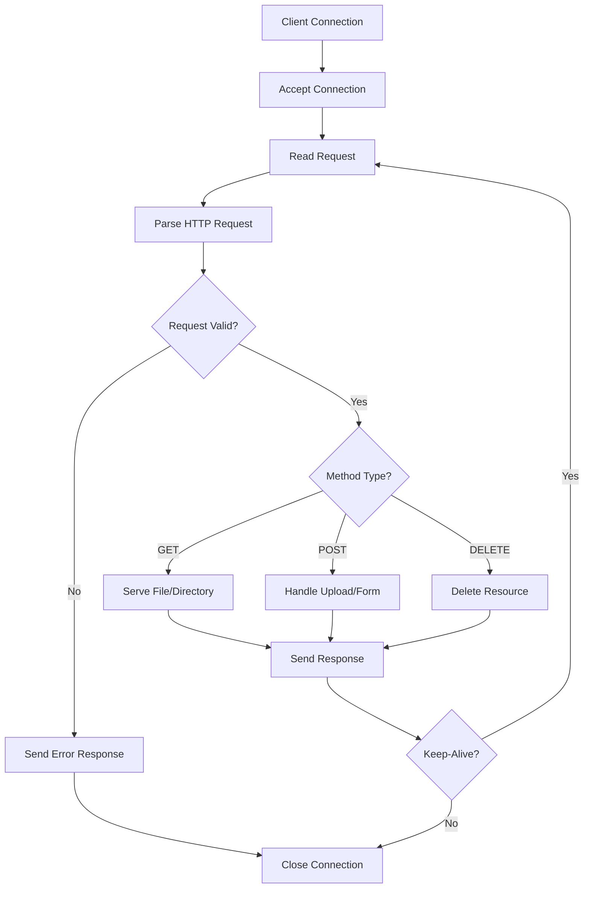
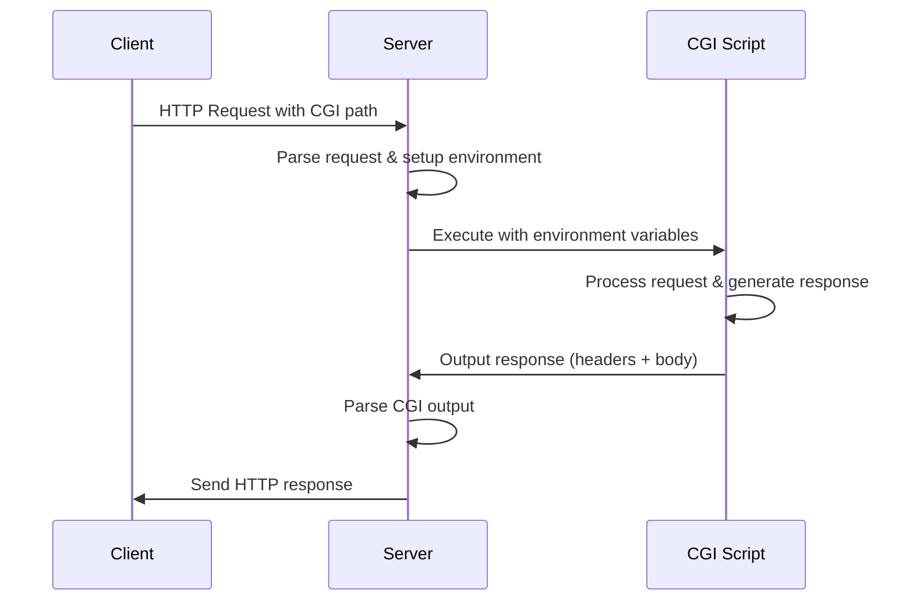

# OneServe - A Custom HTTP/1.1 Server 🚀

[](https://42.fr/)
[](https://isocpp.org/)
[]()

A high-performance HTTP/1.1 web server implementation built from scratch in C++98 as part of the 42 School curriculum. This project demonstrates advanced system programming concepts including socket programming, I/O multiplexing, HTTP protocol implementation, and CGI handling.

## 📋 Table of Contents

- [Features](#-features)
- [Architecture](#-architecture)
- [Installation](#-installation)
- [Configuration](#-configuration)
- [Usage](#-usage)
- [HTTP Methods](#-http-methods)
- [CGI Support](#-cgi-support)
- [Project Structure](#-project-structure)
- [Technical Implementation](#-technical-implementation)
- [Testing](#-testing)
- [Contributing](#-contributing)

## 🌟 Features

### Core HTTP/1.1 Features
- ✅ **HTTP/1.1 Protocol Compliance** - Full HTTP/1.1 support with persistent connections
- ✅ **Multiple HTTP Methods** - GET, POST, DELETE operations
- ✅ **Virtual Hosts** - Multiple server configurations on different ports
- ✅ **Chunked Transfer Encoding** - Efficient handling of large files
- ✅ **File Upload Support** - Multipart form data handling
- ✅ **Directory Listing** - Automatic index generation (autoindex)
- ✅ **Error Pages** - Custom error page handling (400, 403, 404, 405, 500)
- ✅ **Redirections** - HTTP 301/302 redirect support
- ✅ **CGI Support** - Common Gateway Interface for dynamic content

### Performance & Reliability
- ⚡ **I/O Multiplexing** - Epoll-based event handling for high concurrency
- 🔄 **Connection Pooling** - Efficient client connection management
- ⏱️ **Request Timeout** - 60-second timeout for idle connections
- 📊 **Resource Management** - Proper memory and file descriptor handling
- 🛡️ **Security Features** - Request size limits and input validation

## 🏗️ Architecture

### System Design

```
┌─────────────────┐    ┌─────────────────┐    ┌─────────────────┐
│   Config Parser │    │   HTTP Parser   │    │  Response Gen   │
│                 │    │                 │    │                 │
│ • INI Format    │    │ • Method Parse  │    │ • Status Codes  │
│ • Multi-Server  │    │ • Header Parse  │    │ • MIME Types    │
│ • Location Mgmt │    │ • Body Parse    │    │ • Chunked Resp  │
└─────────────────┘    └─────────────────┘    └─────────────────┘
         │                       │                       │
         └───────────────────────┼───────────────────────┘
                                 │
                    ┌─────────────────┐
                    │   Server Core   │
                    │                 │
                    │ • Epoll Events  │
                    │ • Socket Mgmt   │
                    │ • Client Pool   │
                    │ • CGI Handler   │
                    └─────────────────┘
```

### Event-Driven Architecture

The server uses **epoll** for efficient I/O multiplexing:

1. **EPOLLIN** - New connections and incoming requests
2. **EPOLLOUT** - Ready to send responses
3. **EPOLLERR/EPOLLHUP** - Error handling and connection cleanup

### Request Lifecycle



## 🛠️ Installation

### Prerequisites
- C++98 compatible compiler (g++)
- Linux/Unix system with epoll support
- Make build system
- Python3 (for CGI scripts)
- PHP-CGI (for PHP CGI scripts)

### Build Instructions

```bash
# Clone the repository
git clone https://github.com/Xylar-99/OneServe__A-Custom-HTTP-1.1-Server.git
cd OneServe__A-Custom-HTTP-1.1-Server

# Compile the server
make

# Clean build files (optional)
make clean
```

### Quick Start

```bash
# Run with default configuration
./webserv config/default.ini

# Or run without config (uses built-in defaults)
./webserv
```

## ⚙️ Configuration

The server uses INI-style configuration files with three main sections:

### Basic Server Configuration

```ini
[server]
    host        = 127.0.0.1      # Server bind address
    port        = 4000           # Server port
    server_name = localhost      # Server name
    body_size   = 4000M          # Max request body size

[server.errors]
    500 = errors/500.html        # Internal server error page
    404 = errors/404.html        # Not found error page
    403 = errors/403.html        # Forbidden error page
    405 = errors/405.html        # Method not allowed page
    400 = errors/400.html        # Bad request error page

[server.location]
    uri          = /             # Location path
    root         = www           # Document root
    methods      = GET POST DELETE # Allowed HTTP methods
    methods_cgi  = GET POST      # Methods allowed for CGI
    autoindex    = off           # Directory listing
    upload       = uploads       # Upload directory
    cgi          = .py:/usr/bin/python3  # CGI interpreter for .py
    cgi          = .php:/usr/bin/php-cgi # CGI interpreter for .php
```

### Multiple Server Blocks

You can define multiple server blocks for different virtual hosts:

```ini
[server]
    host = 127.0.0.1
    port = 8080
    server_name = site1.local
    # ... other configs

[server]
    host = 127.0.0.1
    port = 8081
    server_name = site2.local
    # ... other configs
```

## 🚀 Usage

### Starting the Server

```bash
# Default configuration
./webserv

# Custom configuration
./webserv config/my_config.ini

# The server will display:
Server is listening on 127.0.0.1:4000...
```

### Testing Basic Functionality

```bash
# Test GET request
curl -X GET http://localhost:4000/

# Test file upload
curl -X POST -F "file=@test.txt" http://localhost:4000/upload

# Test directory listing (if autoindex is on)
curl http://localhost:4000/uploads/

# Test CGI script
curl http://localhost:4000/script.py
```

### Graceful Shutdown

Press `Ctrl+C` to gracefully shutdown the server. The server will:
1. Stop accepting new connections
2. Complete ongoing requests
3. Close all client connections
4. Clean up resources

## 🔧 HTTP Methods

### GET Method
- **File Serving** - Serves static files with appropriate MIME types
- **Directory Listing** - Generates HTML directory indexes when autoindex is enabled
- **CGI Execution** - Executes CGI scripts and returns dynamic content
- **Chunked Transfer** - Automatically uses chunked encoding for large files (>2MB)
- **Range Support** - Basic range request handling

```cpp
// Example: GET request handling flow
int Response::Serve(int client_socket, HttpRequestData &req)
{
    // 1. Check if CGI request
    if (isCGIRequest(req))
        return ServeCGI(client_socket, ext, req);
    
    // 2. Check method permissions
    if (!req._location_res.check("GET"))
        return MethodNotAllowed(client_socket, req);
    
    // 3. Handle redirections
    if (shouldRedirect(req))
        return Http301(client_socket, redirect_url);
    
    // 4. Serve file or directory
    if (isDirectory(path))
        return ServeDirectory(client_socket, path, req);
    else
        return ServeFile(client_socket, path, req);
}
```

### POST Method
- **File Uploads** - Handles multipart/form-data file uploads
- **Form Processing** - Processes application/x-www-form-urlencoded data
- **CGI Processing** - Passes POST data to CGI scripts
- **Content-Length Validation** - Enforces body size limits

### DELETE Method
- **File Deletion** - Removes files from the server
- **Directory Deletion** - Removes empty directories
- **Permission Checking** - Validates delete permissions
- **Cleanup Operations** - Handles associated resource cleanup

## 🔌 CGI Support

The server supports CGI (Common Gateway Interface) for dynamic content generation:

### Supported CGI Languages
- **Python** (.py files) - `/usr/bin/python3`
- **PHP** (.php files) - `/usr/bin/php-cgi`
- **Extensible** - Easy to add support for other interpreters

### CGI Environment Variables

The server sets standard CGI environment variables:

```cpp
// CGI Environment Setup
REQUEST_METHOD=GET|POST|DELETE
QUERY_STRING=key=value&key2=value2
CONTENT_TYPE=application/x-www-form-urlencoded
CONTENT_LENGTH=1024
SCRIPT_NAME=/script.py
PATH_INFO=/additional/path
SERVER_NAME=localhost
SERVER_PORT=4000
HTTP_*=header_values
```

### CGI Request Flow



### Example CGI Scripts

**Python CGI (hello.py)**:
```python
#!/usr/bin/env python3
import os

print("Content-Type: text/html\r")
print("\r")
print("<html><body>")
print("<h1>Hello from Python CGI!</h1>")
print(f"<p>Request Method: {os.environ.get('REQUEST_METHOD', 'Unknown')}</p>")
print(f"<p>Query String: {os.environ.get('QUERY_STRING', 'None')}</p>")
print("</body></html>")
```

**PHP CGI (info.php)**:
```php
<?php
header("Content-Type: text/html");

echo "<html><body>";
echo "<h1>PHP CGI Information</h1>";
echo "<p>Server: " . $_SERVER['SERVER_NAME'] . "</p>";
echo "<p>Method: " . $_SERVER['REQUEST_METHOD'] . "</p>";
phpinfo();
echo "</body></html>";
?>
```

## 📁 Project Structure

```
OneServe/
├── 📄 Makefile                 # Build configuration
├── 📄 README.md               # This file
├── 🗂️ config/                 # Configuration files
│   ├── default.ini            # Default server config
│   └── one_serve.ini          # Alternative config
├── 🗂️ includes/               # Header files
│   ├── webserv.hpp           # Main header
│   ├── 🗂️ config/           # Configuration parsing
│   ├── 🗂️ http/             # HTTP protocol handling
│   ├── 🗂️ server/           # Server core
│   ├── 🗂️ types/            # Type definitions
│   └── 🗂️ utils/            # Utility functions
├── 🗂️ src/                   # Source files
│   ├── main.cpp              # Entry point
│   ├── 🗂️ config/           # Config implementation
│   ├── 🗂️ http/             # HTTP implementation
│   ├── 🗂️ server/           # Server implementation
│   ├── 🗂️ types/            # Type implementations
│   └── 🗂️ utils/            # Utility implementations
├── 🗂️ www/                   # Web root directory
│   ├── index.html            # Default index page
│   ├── 🗂️ errors/           # Error pages
│   ├── 🗂️ media/            # Static media files
│   ├── 🗂️ styles/           # CSS stylesheets
│   └── 🗂️ uploads/          # File upload directory
└── 🗂️ test/                  # Test files and scripts
```

### Key Components

| Component | Description |
|-----------|-------------|
| **Config Parser** | INI file parsing and server configuration |
| **HTTP Parser** | Request parsing with state machine implementation |
| **Response Generator** | HTTP response construction with proper headers |
| **Server Core** | Epoll-based event loop and connection management |
| **CGI Handler** | Process management for CGI script execution |
| **Error Handler** | Comprehensive error page and status code handling |
| **Utils** | MIME type detection, logging, and utility functions |

## ⚙️ Technical Implementation

### State Machine Parser

The HTTP request parser uses a finite state machine for robust parsing:

```cpp
enum PARSE_STATE {
    STATE_REQUEST_METHOD_START,
    STATE_REQUEST_METHOD,
    STATE_REQUEST_URI_START,
    STATE_REQUEST_URI,
    STATE_REQUEST_HTTP_START,
    STATE_REQUEST_HTTP_VERSION,
    STATE_REQUEST_HEADER_START,
    STATE_REQUEST_HEADER_KEY,
    STATE_REQUEST_HEADER_VALUE,
    STATE_REQUEST_BODY_START,
    STATE_REQUEST_BODY,
    STATE_REQUEST_COMPLETE
};
```

### Memory Management

The server implements careful memory management:
- **RAII** - Resource Acquisition Is Initialization patterns
- **Smart Cleanup** - Automatic resource cleanup on connection close
- **File Descriptor Management** - Proper fd lifecycle management
- **Temporary File Handling** - Cleanup of uploaded and CGI-generated files

### Performance Optimizations

1. **Epoll Edge-Triggered Mode** - Efficient event notification
2. **Connection Reuse** - HTTP/1.1 persistent connections
3. **Chunked Transfer** - Memory-efficient large file serving
4. **Buffered I/O** - Optimal buffer sizes for different operations
5. **Non-blocking I/O** - Prevents server blocking on slow clients

### Security Features

- **Request Size Limits** - Configurable maximum body size
- **Path Traversal Prevention** - Blocks `../` path attempts
- **Input Validation** - Validates all HTTP components
- **Resource Limits** - Connection and file descriptor limits
- **Error Information Hiding** - Generic error messages to prevent information disclosure

## 🧪 Testing

### Manual Testing

```bash
# Test static file serving
curl -v http://localhost:4000/index.html

# Test directory listing
curl -v http://localhost:4000/uploads/

# Test file upload
curl -X POST -F "file=@test.txt" http://localhost:4000/uploads/

# Test CGI execution
curl -v http://localhost:4000/test.py

# Test error handling
curl -v http://localhost:4000/nonexistent.html

# Test large file handling
curl -v http://localhost:4000/large_file.zip

# Test concurrent connections
for i in {1..10}; do
    curl -v http://localhost:4000/ &
done
wait
```

### Automated Testing

Create a test script to validate functionality:

```bash
#!/bin/bash
# test_server.sh

SERVER_URL="http://localhost:4000"

echo "Testing GET requests..."
curl -s -o /dev/null -w "%{http_code}" "$SERVER_URL/"
echo

echo "Testing POST upload..."
echo "test content" > test_upload.txt
curl -s -o /dev/null -w "%{http_code}" -X POST -F "file=@test_upload.txt" "$SERVER_URL/uploads/"
rm test_upload.txt
echo

echo "Testing CGI..."
curl -s -o /dev/null -w "%{http_code}" "$SERVER_URL/test.py"
echo

echo "Testing 404 error..."
curl -s -o /dev/null -w "%{http_code}" "$SERVER_URL/nonexistent"
echo
```

### Performance Testing

```bash
# Stress test with multiple concurrent connections
ab -n 1000 -c 10 http://localhost:4000/

# Test with siege
siege -c 20 -t 60s http://localhost:4000/
```

## 🎯 42 School Project Requirements

This project fulfills the following 42 School webserver requirements:

### Mandatory Requirements
- ✅ HTTP/1.1 compliant web server
- ✅ Non-blocking I/O operations
- ✅ Configuration file support
- ✅ Multiple server instances
- ✅ HTTP methods: GET, POST, DELETE
- ✅ Error page customization
- ✅ CGI support for dynamic content
- ✅ File upload capability
- ✅ Proper HTTP status code handling

### Technical Constraints
- ✅ Written in C++98
- ✅ No external libraries (except standard library)
- ✅ Memory leak prevention
- ✅ Signal handling
- ✅ Proper resource management

### Bonus Features
- ✅ Multiple CGI interpreters
- ✅ Chunked transfer encoding
- ✅ Keep-alive connections
- ✅ Directory listing
- ✅ File upload progress

## 📝 Configuration Examples

### Development Server
```ini
[server]
    host = 127.0.0.1
    port = 3000
    server_name = dev.local
    body_size = 100M

[server.location]
    uri = /
    root = www
    methods = GET POST DELETE
    autoindex = on
    upload = uploads
```

### Production-like Server
```ini
[server]
    host = 0.0.0.0
    port = 80
    server_name = production.com
    body_size = 10M

[server.location]
    uri = /
    root = /var/www/html
    methods = GET
    autoindex = off
```

### API Server with CGI
```ini
[server]
    host = 127.0.0.1
    port = 8080
    server_name = api.local
    body_size = 50M

[server.location]
    uri = /api
    root = api
    methods = GET POST
    methods_cgi = GET POST
    cgi = .py:/usr/bin/python3
```

## 🤝 Contributing

This is a 42 School project, but contributions for educational purposes are welcome:

1. Fork the repository
2. Create a feature branch (`git checkout -b feature/amazing-feature`)
3. Commit your changes (`git commit -m 'Add amazing feature'`)
4. Push to the branch (`git push origin feature/amazing-feature`)
5. Open a Pull Request

### Development Guidelines
- Follow C++98 standards strictly
- Maintain consistent code style
- Add comprehensive comments
- Test thoroughly before submitting
- Document any new features

## 📋 TODO & Future Improvements

### Current TODOs (from source comments):
- [ ] Content-Length validation improvements
- [ ] Port handling in URI parsing
- [ ] Connection timeout implementation (read/write/idle)
- [ ] Expect: 100-continue header handling
- [ ] HTTP method validation per location
- [ ] Content-Type validation for requests
- [ ] 413 Payload Too Large proper implementation
- [ ] HTTP/1.0 connection handling

### Potential Enhancements:
- [ ] SSL/TLS support (HTTPS)
- [ ] WebSocket support
- [ ] HTTP/2 protocol support
- [ ] Rate limiting
- [ ] Access logging
- [ ] Compression (gzip)
- [ ] Cache-Control headers
- [ ] Virtual host based on Host header

## 📜 License

This project is part of the 42 School curriculum and is intended for educational purposes.

## 🙏 Acknowledgments

- **42 School** - For the comprehensive system programming curriculum
- **HTTP/1.1 RFC 7230-7235** - Protocol specification reference
- **NGINX** - Inspiration for configuration format and behavior
- **Apache** - CGI implementation reference

---

**Built with ❤️ at 42 School**

*"The best way to learn is by building something complex from scratch."*
